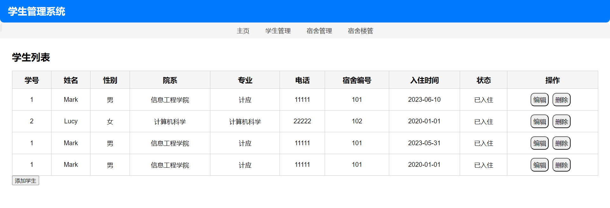
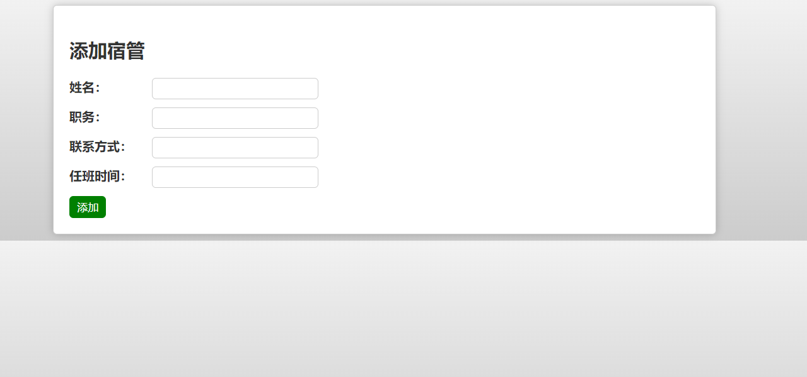
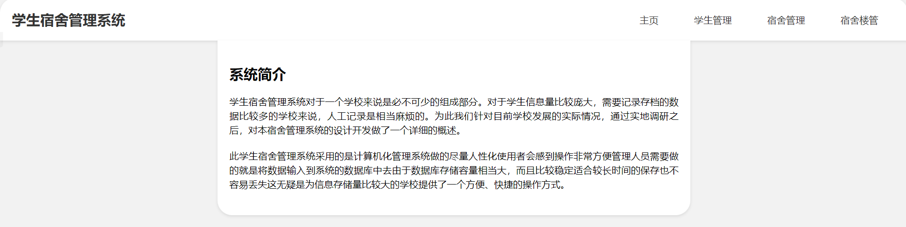
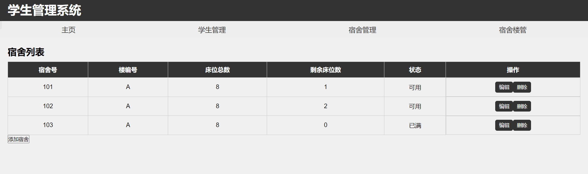
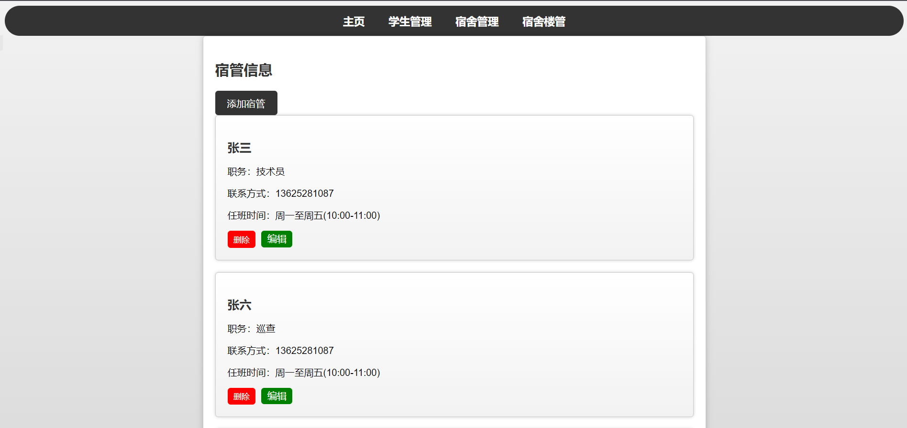
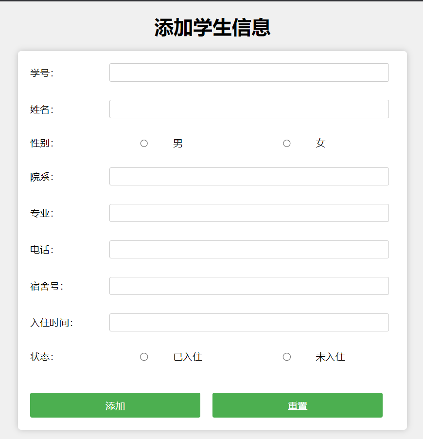
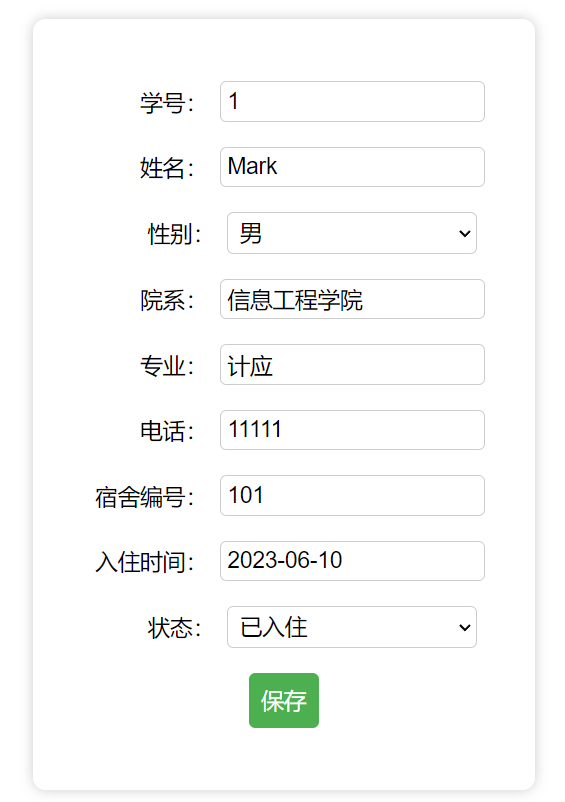
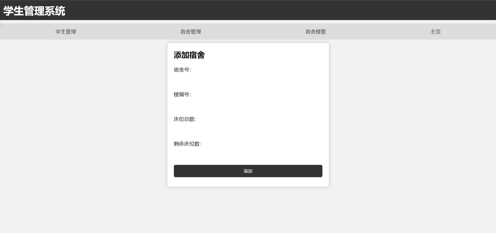
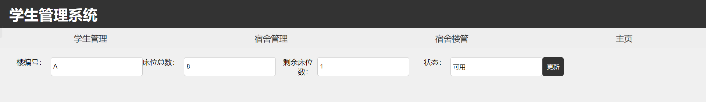
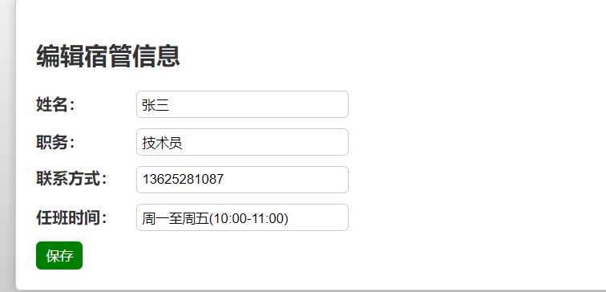

### 说明

此项目为个人课设,完全开源.而且不怎么会更新,完全为了课设而已,新人自学很多屎山请谅解,也请大佬勿喷.

### 管理员账号密码

admin
123456

### 数据库信息:

// 连接数据库

```
$servername = "localhost";
$username = "root";
$password = "040122";
$dbname = "dormitory";
```

### 数据库表

数据库表:

```dormitories
students
dormitory_managers
```

### 环境:

MySQL5.7.26
Nginx1.15.11
PHP8.0

数据库图形化:
Navicat Premium 16


























### 更新3.0

1. 归类文件

### 更新2.0

1.  新美化了宿管信息页面
2.  宿管信息页面连接数据库,实现了增,删,改
3.  重构index.html主页面
4.  添加了edit.php/update.php/add-dorm-manager.php